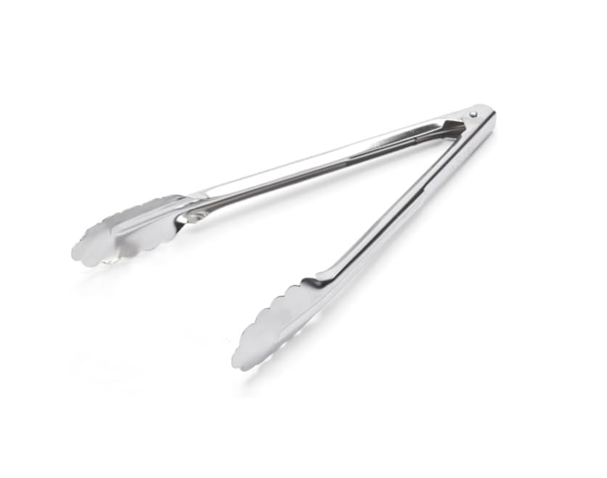

A few weeks ago, my team had a potluck, and I brought chicken chow mein.

I put the noodles in a large glass container. When I put it on the table, one of my coworkers said he'd love to learn how to use chopsticks. Unfortunately, I hadn't brought extra chopsticks with me, which, looking back, was probably a missed opportunity, haha.

But I had actually brought a serving utensil to help everyone serve themselves. Then I realized that I didn't actually know what it was called in English, so I just called it "this thing" or maybe a "clip."

Apparently, it's simply called a pair of "tongs."

I also learned that the word has a very old Germanic origin. It is related to the Dutch word "tang," and both words refer to tools used for gripping or holding things.

Since I live in the Netherlands now, the connection between "tongs" and the Dutch word "tang" makes the word much easier for me to remember.

